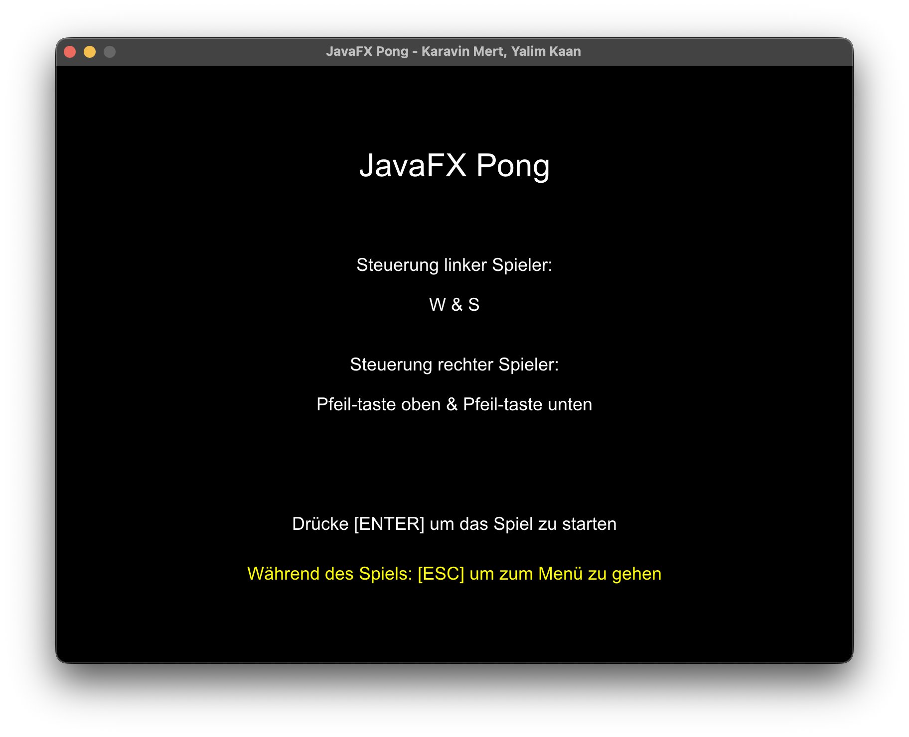
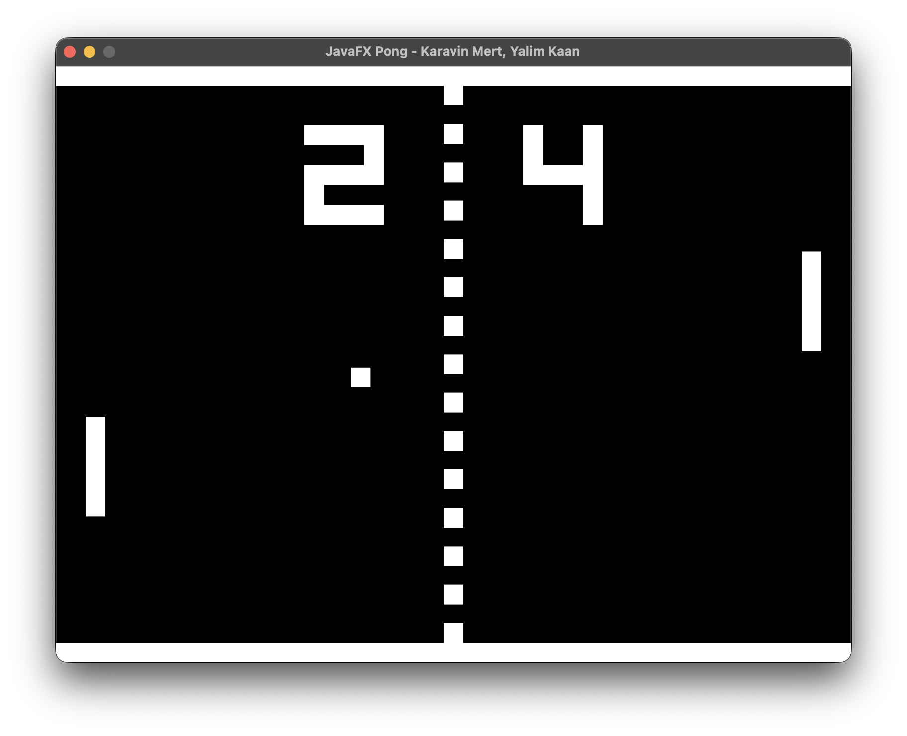

# Pong

Dieses Projekt ist ein Schulprojekt für Softwareentwicklung (SEW) und wurde als Abschlussarbeit in einer 2er-Gruppe entwickelt.

Es handelt sich um eine klassische Pong-Variante in Java mit JavaFX. Ziel des Projekts war die Umsetzung von objektorientierter Programmierung, GUI-Entwicklung mit JavaFX und einer einfachen Spiel- und KI-Struktur.

## Screenshots

| Hauptmenü | Gameplay |
| :---: | :---: |
|  |  |

## Projektstruktur

- [`Launcher.java`](file:///Users/metiny/Desktop/github/pong/src/main/java/com/example/pong/Launcher.java) – Startpunkt der Java-Anwendung
- [`PongApplication.java`](file:///Users/metiny/Desktop/github/pong/src/main/java/com/example/pong/pong/PongApplication.java) – JavaFX Application-Klasse und Haupt-Game-Loop
- [`PongContext.java`](file:///Users/metiny/Desktop/github/pong/src/main/java/com/example/pong/pong/PongContext.java) – Spielzustand (Scores, Spielmodus, Schwierigkeitsgrad)
- [`GameMode.java`](file:///Users/metiny/Desktop/github/pong/src/main/java/com/example/pong/pong/GameMode.java) – Enum für Singleplayer und Multiplayer
- [`Difficulty.java`](file:///Users/metiny/Desktop/github/pong/src/main/java/com/example/pong/pong/Difficulty.java) – Enum für KI-Schwierigkeitsgrade
- [`AIPaddle.java`](file:///Users/metiny/Desktop/github/pong/src/main/java/com/example/pong/pong/ai/AIPaddle.java) – Logik für das KI-gesteuerte Paddle
- [`CourtScene.java`](file:///Users/metiny/Desktop/github/pong/src/main/java/com/example/pong/pong/scene/CourtScene.java) – Hauptspielfeld mit Ballphysik, Kollisionen und Punktestand
- [`WelcomeScene.java`](file:///Users/metiny/Desktop/github/pong/src/main/java/com/example/pong/pong/scene/WelcomeScene.java) – Start- und Willkommensbildschirm
- [`ModeSelectionScene.java`](file:///Users/metiny/Desktop/github/pong/src/main/java/com/example/pong/pong/scene/ModeSelectionScene.java) – Menü zur Auswahl des Spielmodus
- [`DifficultySelectionScene.java`](file:///Users/metiny/Desktop/github/pong/src/main/java/com/example/pong/pong/scene/DifficultySelectionScene.java) – Menü zur Auswahl der KI-Schwierigkeit
- [`EndGameScene.java`](file:///Users/metiny/Desktop/github/pong/src/main/java/com/example/pong/pong/scene/EndGameScene.java) – Endbildschirm bei Spielende
- [`AbstractScene.java`](file:///Users/metiny/Desktop/github/pong/src/main/java/com/example/pong/pong/scene/AbstractScene.java) – Basisklasse für alle Spielszenen
- [`Args.java`](file:///Users/metiny/Desktop/github/pong/src/main/java/com/example/pong/pong/util/Args.java) – Validierungs-Hilfsklasse

## Steuerung

- **Linker Spieler (Spieler 1)**: `W` / `S`
- **Rechter Spieler (Spieler 2)**: `Pfeiltaste Oben` / `Pfeiltaste Unten` (im Multiplayer)
- **Menü**: `Pfeiltasten` zum Auswählen, `Enter` zum Bestätigen
- **Im Spiel**: `ESC` für Rückkehr zum Menü

## Ausführen

```bash
./mvnw clean javafx:run
```